# 認證方法教學：SSO vs OAuth vs OIDC vs SAML

> 一個給**初學者**的專案：用**測試驅動**的方式，搭配 **Hexagonal Architecture（六角形 / Ports & Adapters）+ DDD + SOLID**，
> 以 **JDK 23 + Spring Boot 4** 親手實作並驗證四種身分／授權概念。
>
> 全部 **53 個測試**執行 `./mvnw test` 即可綠燈通過，**不需要 Docker、不需要外部服務**。

靈感來自下面兩張圖（原圖放在 [`docs/images`](docs/images/)）：

| 概念說明 | 流程圖 |
| --- | --- |
| 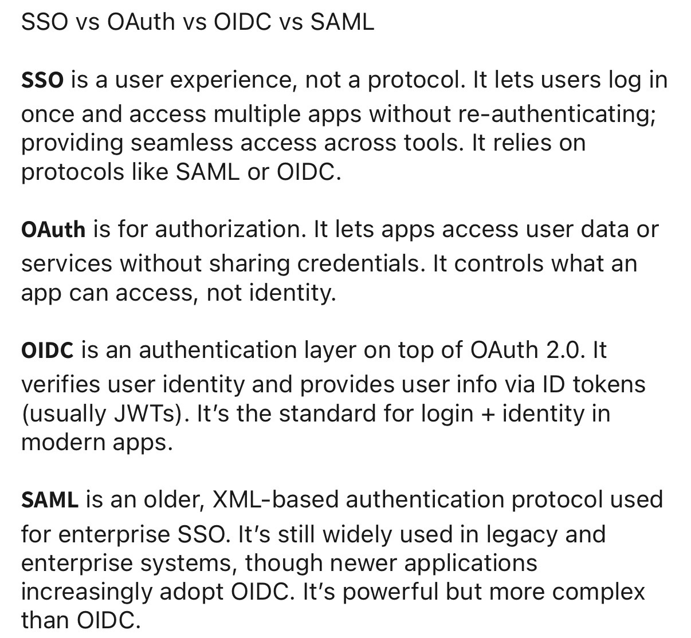 | 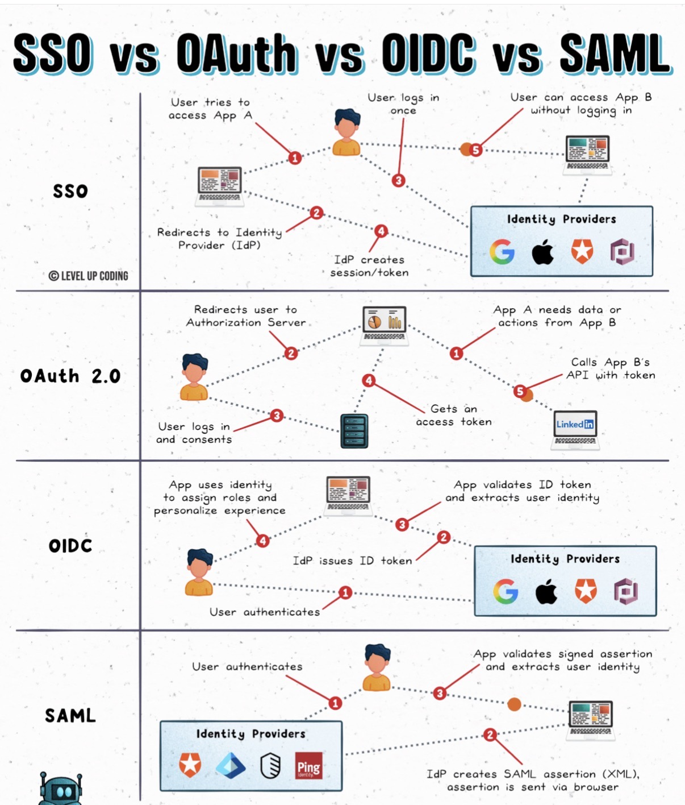 |

---

## 目錄

1. [先搞懂四個名詞](#1-先搞懂四個名詞)
2. [10 分鐘快速開始](#2-10-分鐘快速開始)
3. [架構總覽（架構圖）](#3-架構總覽架構圖)
4. [為什麼這樣分層？六角形 + DDD + SOLID](#4-為什麼這樣分層六角形--ddd--solid)
5. [專案結構與 bounded context](#5-專案結構與-bounded-context)
6. [四種流程逐一拆解（循序圖 + 類別圖 + 測試）](#6-四種流程逐一拆解循序圖--類別圖--測試)
   - [6.1 SSO](#61-sso單一登入登入一次存取多個-app)
   - [6.2 OAuth 2.0](#62-oauth-20授權能存取什麼)
   - [6.3 OIDC](#63-oidc身分你是誰id-token--jwt)
   - [6.4 SAML](#64-saml企業常見的-xml-斷言)
7. [測試策略（測試金字塔）](#7-測試策略測試金字塔)
8. [進階：用真實 Keycloak 做 OIDC 整合測試](#8-進階用真實-keycloak-做-oidc-整合測試)
9. [Docker Compose / Kubernetes / OpenLDAP](#9-docker-compose--kubernetes--openldap)
10. [初學者常見問題 FAQ](#10-初學者常見問題-faq)

> 💡 本文大量使用 [Mermaid](https://mermaid.js.org/) 圖。GitHub 會自動把它們渲染成圖；
> 若你的編輯器看到的是程式碼區塊，請安裝 Mermaid 外掛或直接在 GitHub 上瀏覽。

---

## 1. 先搞懂四個名詞

| 概念 | 它是什麼 | 回答的問題 | 本專案對應套件 |
| --- | --- | --- | --- |
| **SSO** | 一種**使用者體驗**，不是協定。登入一次就能存取多個 App。 | —（底層靠 SAML/OIDC） | [`sso`](src/main/java/com/example/authtutorial/sso) |
| **OAuth 2.0** | **授權 (Authorization)** 框架。讓 App 在不拿到密碼下存取資源。 | 「這個 App **能存取什麼**？」 | [`oauth`](src/main/java/com/example/authtutorial/oauth) |
| **OIDC** | 架在 OAuth 2.0 之上的**身分驗證 (Authentication)** 層，發 ID Token（JWT）。 | 「**你是誰**？」 | [`oidc`](src/main/java/com/example/authtutorial/oidc) |
| **SAML** | 較早期、以 **XML** 為基礎的企業級 SSO 認證協定。 | 「**你是誰**？」（企業/傳統系統） | [`saml`](src/main/java/com/example/authtutorial/saml) |

用一張圖把它們的關係講清楚：

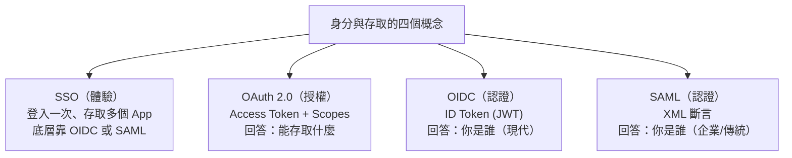

> 一句話：**OAuth 管「能做什麼」；OIDC / SAML 管「你是誰」；SSO 是「只登一次」的體驗。**

---

## 2. 10 分鐘快速開始

### 需求
- **JDK 23**（Spring Boot 4 需要 JDK 17+；本專案以 23 編譯）
- 能連線到 Maven Central（首次建置會下載相依）

### 跑測試（驗證所有功能，不需要 Docker）
```bash
./mvnw test
```
你會看到 **53 個測試**全部通過。這就是「從測試角度驗證所有功能」。

### 啟動應用程式
```bash
./mvnw spring-boot:run
```
然後用 [`docs/api-examples.http`](docs/api-examples.http)（或下方各節的 curl）逐一打 API。

---

## 3. 架構總覽（架構圖）

整個系統是一個**六角形 (Hexagonal)**：核心（domain + application）在中間，
外界透過**埠 (port)** 進出，具體技術（HTTP、記憶體、Keycloak…）是可替換的**轉接器 (adapter)**。

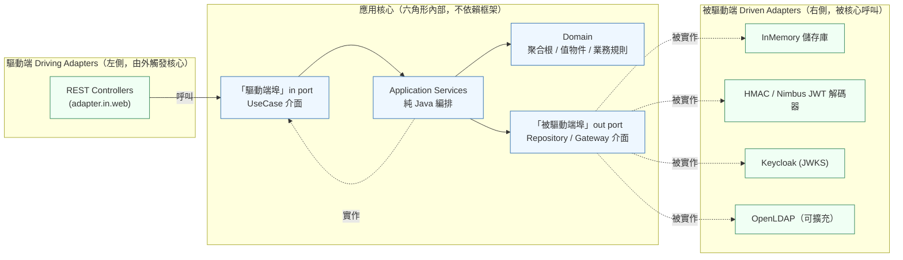

**相依方向永遠由外向內：`adapter → port → application → domain`。**
domain 不認得任何外圈的東西，這讓它能被獨立、快速地測試。

---

## 4. 為什麼這樣分層？六角形 + DDD + SOLID

各層的職責：

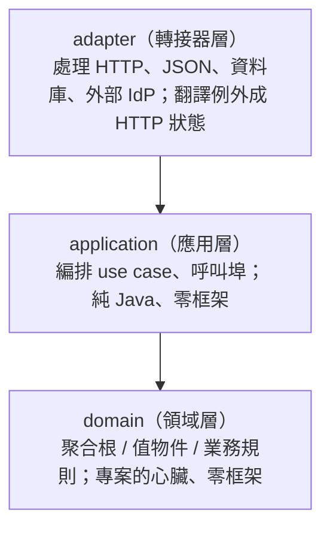

對照 **SOLID**：

| 原則 | 在本專案怎麼體現 |
| --- | --- |
| **S** 單一職責 | domain 管規則、application 管編排、adapter 管 I/O。 |
| **O** 開放封閉 | 新增 `LdapIdentityProviderAdapter` 不必改 domain。 |
| **L** 里氏替換 | 任何 `IdentityProviderPort` 實作都能互換（記憶體 ↔ LDAP）。 |
| **I** 介面隔離 | `AccessTokenIssuerPort` 與 `AccessTokenIntrospectionPort` 拆成兩個小埠。 |
| **D** 依賴反轉 | domain 定義埠（介面），adapter 實作；由[組合根](src/main/java/com/example/authtutorial/config/BeanConfiguration.java)注入。 |

> ✅ **架構即測試**：[`HexagonalArchitectureTest`](src/test/java/com/example/authtutorial/architecture/HexagonalArchitectureTest.java)
> 用 ArchUnit 自動擋下「domain 依賴 Spring」「application 依賴 adapter」等違規。架構不會在重構中腐化。

---

## 5. 專案結構與 bounded context

每個概念都是一個 **bounded context**，內部都遵循相同的六角形分層：

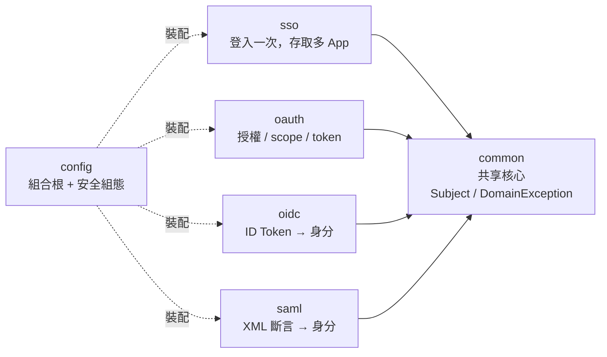

實體目錄（以 `sso` 為例，其餘 context 結構相同）：

```
src/main/java/com/example/authtutorial/
├── common/domain/              共享核心：Subject、DomainException
├── sso/
│   ├── domain/model/           SsoSession（聚合根）、SessionId、Credentials
│   ├── domain/port/in/         SingleSignOnUseCase（驅動端埠）
│   ├── domain/port/out/        IdentityProviderPort、SsoSessionRepository（被驅動端埠）
│   ├── application/            SingleSignOnService（純 Java 編排）
│   └── adapter/
│       ├── in/web/             SsoController（REST 驅動轉接器）
│       └── out/                DemoIdentityProviderAdapter、InMemorySsoSessionRepository
├── oauth/  oidc/  saml/        同樣的 domain / application / adapter 結構
└── config/                     BeanConfiguration（組合根）、SecurityConfiguration
```

`src/test/java/...` 的測試與正式碼一一對映。

---

## 6. 四種流程逐一拆解（循序圖 + 類別圖 + 測試）

### 6.1 SSO（單一登入）：登入一次，存取多個 App

**流程（循序圖）** — 對照原圖：存取 App A → 導向 IdP → 登入一次 → 建立 session → 存取 App B 免再登入。

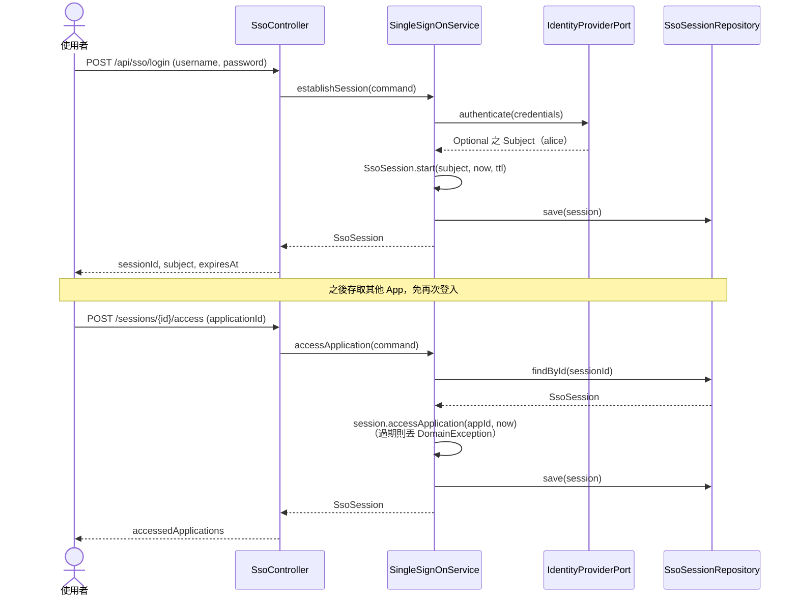

**結構（類別圖）**

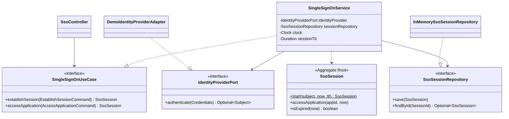

**試一試**
```bash
curl -s localhost:8080/api/sso/login -H 'Content-Type: application/json' \
  -d '{"username":"alice","password":"wonderland"}'
# → 取得 sessionId，再用它存取 App（不必再送密碼）
curl -s localhost:8080/api/sso/sessions/<SESSION_ID>/access \
  -H 'Content-Type: application/json' -d '{"applicationId":"gmail"}'
```

**相關測試**：[`SsoSessionTest`](src/test/java/com/example/authtutorial/sso/domain/model/SsoSessionTest.java)（過期規則）、
[`SingleSignOnServiceTest`](src/test/java/com/example/authtutorial/sso/application/SingleSignOnServiceTest.java)（免再登入）。

---

### 6.2 OAuth 2.0（授權）：能存取什麼？

**流程（循序圖）** — 對照原圖：App A 需存取 App B → 導向授權伺服器 → 使用者登入並**同意** →
取得 access token → 用 token 呼叫 API。

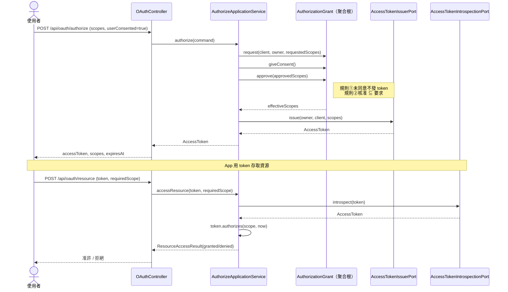

**結構（類別圖）**

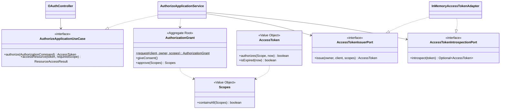

**試一試**
```bash
curl -s localhost:8080/api/oauth/authorize -H 'Content-Type: application/json' -d '{
  "clientId":"app-A","resourceOwner":"alice",
  "requestedScopes":["contacts.read","contacts.write"],
  "approvedScopes":["contacts.read"],"userConsented":true }'
curl -s -X POST "localhost:8080/api/oauth/resource?token=<TOKEN>&requiredScope=contacts.read"
```

**相關測試**：[`AuthorizationGrantTest`](src/test/java/com/example/authtutorial/oauth/domain/model/AuthorizationGrantTest.java)（同意/子集規則）、
[`AuthorizeApplicationServiceTest`](src/test/java/com/example/authtutorial/oauth/application/AuthorizeApplicationServiceTest.java)（授權→存取資源）。

---

### 6.3 OIDC（身分）：你是誰？（ID Token / JWT）

驗證分兩段，正好對應六角形兩側：**被驅動端驗簽章 → domain 驗 claims**。

**流程（循序圖）**

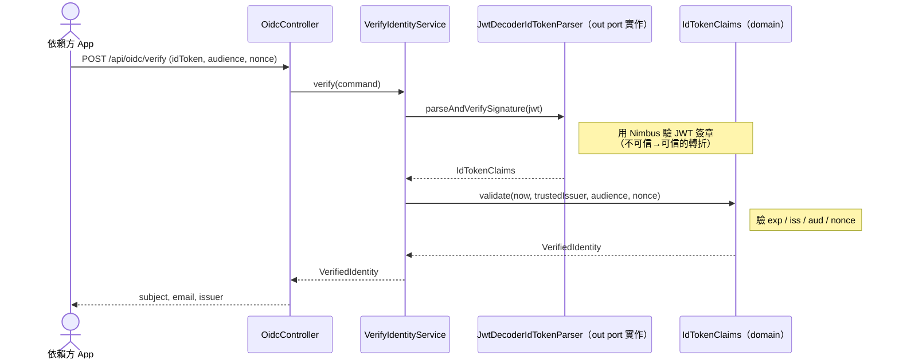

**結構（類別圖）**

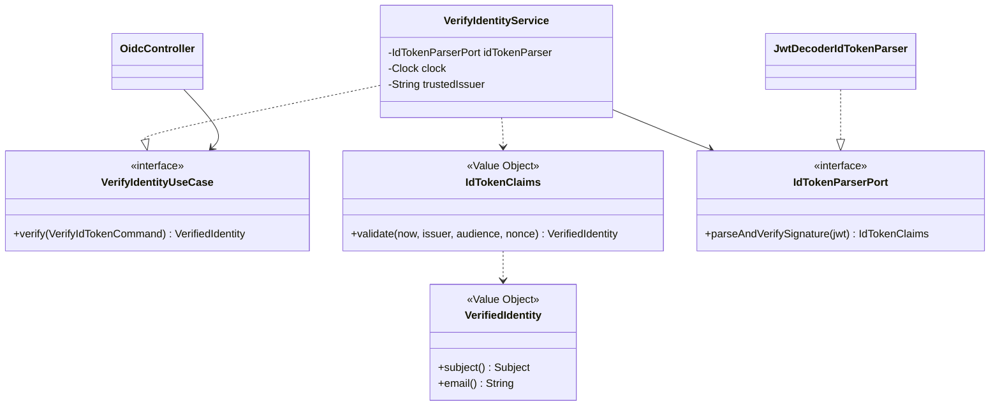

[`VerifyIdentityServiceTest`](src/test/java/com/example/authtutorial/oidc/application/VerifyIdentityServiceTest.java)
走**真實的 HS256 簽章驗證**，但用共享密鑰所以**完全離線**就能跑；要用真正的 IdP 請見[第 8 節](#8-進階用真實-keycloak-做-oidc-整合測試)。

**相關測試**：[`IdTokenClaimsTest`](src/test/java/com/example/authtutorial/oidc/domain/model/IdTokenClaimsTest.java)（過期/受眾/nonce）、`VerifyIdentityServiceTest`（含竄改偵測）。

---

### 6.4 SAML（企業常見的 XML 斷言）

同樣是「先驗簽章、再驗條件 (Conditions)」。

**流程（循序圖）**

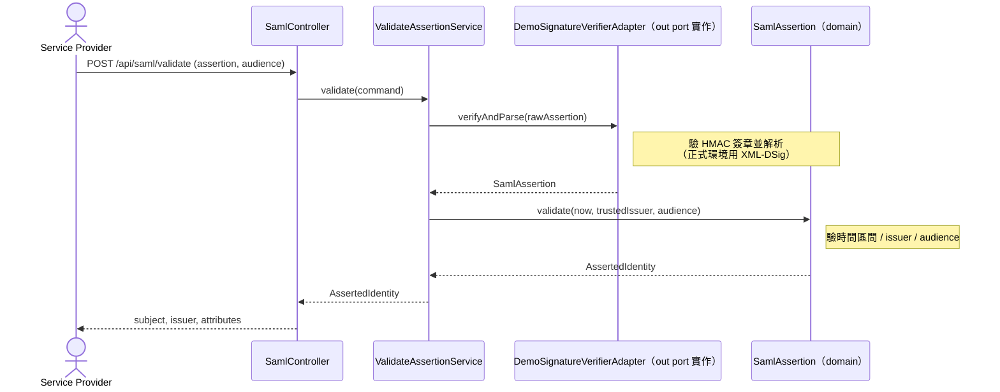

**結構（類別圖）**

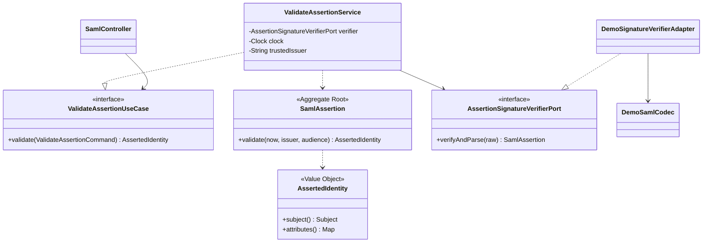

> **教學簡化**：真正的 SAML 用 XML + XML-DSig（通常以 OpenSAML / Spring Security SAML 實作）。
> 為了讓初學者聚焦在「驗簽章 → 驗條件」的**架構邊界**，
> [`DemoSamlCodec`](src/main/java/com/example/authtutorial/saml/adapter/out/DemoSamlCodec.java)
> 以 `base64(JSON).HMAC` 模擬「已簽章的斷言」。只要替換這個 adapter，domain 完全不動。

**相關測試**：[`SamlAssertionTest`](src/test/java/com/example/authtutorial/saml/domain/model/SamlAssertionTest.java)（條件驗證）、
[`DemoSamlCodecTest`](src/test/java/com/example/authtutorial/saml/adapter/out/DemoSamlCodecTest.java)（竄改偵測）、
[`ValidateAssertionServiceTest`](src/test/java/com/example/authtutorial/saml/application/ValidateAssertionServiceTest.java)。

---

## 7. 測試策略（測試金字塔）

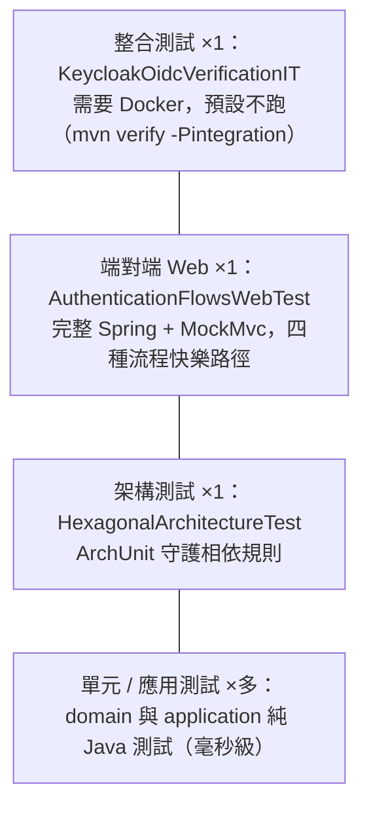

| 層級 | 範例 | 需要 Docker？ | `mvn test` 會跑？ |
| --- | --- | --- | --- |
| 單元（domain） | `SsoSessionTest`、`IdTokenClaimsTest`、`AuthorizationGrantTest` | 否 | ✅ |
| 應用（use case） | `SingleSignOnServiceTest`、`AuthorizeApplicationServiceTest` | 否 | ✅ |
| 架構 | `HexagonalArchitectureTest` | 否 | ✅ |
| 端對端 Web | `AuthenticationFlowsWebTest` | 否 | ✅ |
| 整合 | `KeycloakOidcVerificationIT` | 是 | ❌（需 `-Pintegration`） |

執行 `./mvnw test` → **53 個測試全綠**，完全離線。

---

## 8. 進階：用真實 Keycloak 做 OIDC 整合測試

[`KeycloakOidcVerificationIT`](src/test/java/com/example/authtutorial/oidc/integration/KeycloakOidcVerificationIT.java)
用 **Testcontainers** 啟動真正的 Keycloak（匯入 [`tutorial-realm.json`](src/test/resources/keycloak/tutorial-realm.json)），
向它換取**真實 ID Token**，再用 Keycloak 的 JWKS 公鑰跑我們的 `VerifyIdentityService`。

```bash
# 需要可用的 Docker，且能拉取 quay.io/keycloak/keycloak 映像檔
./mvnw verify -Pintegration
```

> **疑難排解（新版 Docker）**：若看到 `client version 1.32 is too old. Minimum supported API version is 1.44`，
> 代表你的 Docker Engine（25.0+）已不支援 docker-java 預設協商的舊 API。本專案已在 `pom.xml`
> 把整合測試的 `api.version` 預設為 `1.44`；如需相容更舊的 daemon，可覆寫：
> `./mvnw verify -Pintegration -Ddocker.api.version=<版本>`。
> 另外請確認 `DOCKER_HOST` 指向正確的 socket（例如 `unix:///var/run/docker.sock`）。

這正是六角形架構的威力：**同一個 domain / application，換上不同的被驅動端 adapter
（HMAC 離線解碼器 ↔ Keycloak JWKS 解碼器），就能在「快速離線測試」與「真實 IdP 驗證」間自由切換。**

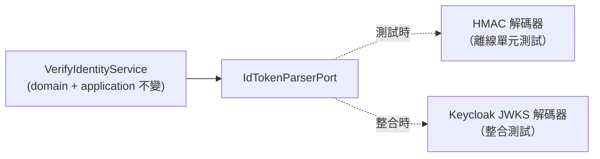

---

## 9. Docker Compose / Kubernetes / OpenLDAP

### 本機手動把玩（選配）
```bash
docker compose up -d
# Keycloak     http://localhost:8081 (admin/admin)，已匯入 tutorial realm
# OpenLDAP     ldap://localhost:389（企業目錄，可作為 SSO 後端）
# phpLDAPadmin http://localhost:8082
```
`docker-compose.yml` 的 **OpenLDAP** 示範了「企業目錄」這個常見的 SSO 後端。
你可以新增 `LdapIdentityProviderAdapter implements IdentityProviderPort`，
把 SSO 的身分來源從記憶體換成 LDAP，而**完全不動 domain**。

### Kubernetes

整體部署架構（App + Keycloak + OpenLDAP 都在同一個 `auth-tutorial` namespace）：

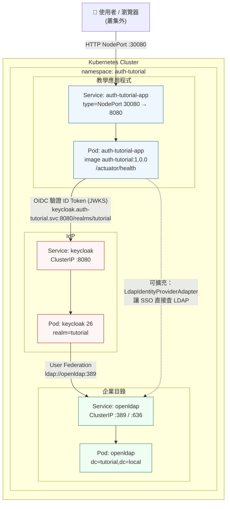

**叢集內的關係：**
- 使用者從叢集外經 **NodePort `30080`** 打到 App。
- App 透過叢集 DNS `keycloak.auth-tutorial.svc.cluster.local:8080` 取得 Keycloak 的 **JWKS 公鑰**來驗證 ID Token（見 `k8s/app.yaml` 的 `OIDC_TRUSTED-ISSUER`）。
- Keycloak 以 **User Federation** 連到 `openldap:389`，把企業目錄當作使用者來源（在 Keycloak realm 設定）。
- （選配）App 的 SSO 也可加一個 `LdapIdentityProviderAdapter` 直接查 LDAP —— domain 不需更動。

部署指令：
```bash
docker build -t auth-tutorial:1.0.0 .
kubectl apply -f k8s/namespace.yaml
kubectl apply -f k8s/openldap.yaml   # 企業目錄
kubectl apply -f k8s/keycloak.yaml   # IdP（可在 realm 設定指向 openldap 的 User Federation）
kubectl apply -f k8s/app.yaml        # 教學應用程式
```

---

## 10. 初學者常見問題 FAQ

**Q：OAuth 和 OIDC 到底差在哪？**
A：OAuth 給你 **access token**（代表「權限」）去呼叫 API；OIDC 額外給你 **ID Token**（代表「身分」）告訴你使用者是誰。
本專案 `oauth` 與 `oidc` 兩套件刻意分開，讓你看清差異。

**Q：為什麼 domain 不能 import Spring？**
A：把業務規則和框架解耦，才能（1）用純 JUnit 毫秒級測試、（2）將來換框架/換 IdP 不傷核心。
`HexagonalArchitectureTest` 會自動守住這條線。

**Q：為什麼用 `record` 和 `Clock`？**
A：`record` 讓值物件天生不可變、好比較；注入 `Clock` 讓「過期」這類時間規則能用**固定時間**穩定測試。

**Q：為什麼簽章驗證放在 adapter，claims/條件驗證放在 domain？**
A：簽章是「技術細節」（HMAC？RSA？JWKS？），會隨環境變；business claims（過期、受眾、nonce）是「業務規則」，應放在核心並被獨立測試。

**Q：這些密鑰可以上正式環境嗎？**
A：**不行**。`application.yml` 的 HMAC / SAML 密鑰只供教學。正式環境請改用 IdP 的非對稱金鑰（RS256 + JWKS）。

---

### 授權
本教學程式碼僅供學習使用。
